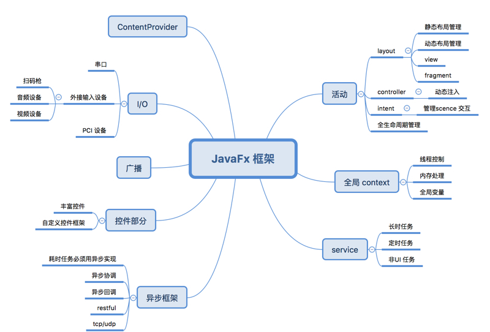

# AchillesFx
> 健壮敏捷的JavaFx桌面开发框架，目标是探索最好的JavaFx开发模式，并且使其拥有和开发Android一样美好的体验

程序员 & 程序猿们，

面对桌面程序开发，特别是面对Java 的 UI 开发，你们是不是感到很淡淡的疼。桌面程序的没落，Java 在桌面程序界的长期打酱油，再加上 oracle 对 java 的糟蹋，让我们很无奈。但是，总有那么一些人，他们在坚守，从 swing 到 javafx，总有一个梦想，能不能更方便一点。

纵观目前 UI 开发领域，移动程序占据着大片江山，尤以 Android 为盛，作为一个伪全栈工程师，在开发 Android 的时候，突发奇想，如果把 javafx 改造成 Android 风格的框架，是不是更好一些，毕竟 javafx 是有些先天不足，后天畸形的意思。所以就有了这个项目。

这个项目可以给java 桌面 UI 开发者不一样的开发体验，采用 Android 系统的风格，概念，相似的 API 。提供类似 Android 的 activity , service， 异步操作等概念和功能，提供统一资源管理， I/O 操作，数据库等开发组件。让 Android 开发者在 javafx 里面找到家的感觉。

如果这个项目能够活下去，还会有大量的自定义控件，平台差异化，依赖注入等功能。

当然，以上三段都是在树（tree）新（new）风（bee），是骡子是马，还是要溜溜代码的。未来的时间里，请看我们不一样的表现。

项目设想思维导图：

